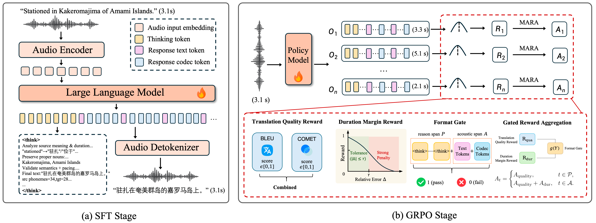

<div align="center">

# DuraS2ST

### Chain-of-Thought and Reinforcement Learning for Duration-Aligned Speech-to-Speech Translation

Yayue Deng<sup>1</sup>, Shujie Liu<sup>2</sup>, Dingdong Wang<sup>1</sup>, Yuxuan Hu<sup>2</sup>, Jinyu Li<sup>2</sup>, Yanqing Liu<sup>2</sup>, Yuanyuan Wang<sup>1</sup>, Weidong Chen<sup>1</sup>, Helen M. Meng<sup>1</sup>, Xixin Wu<sup>1</sup>

<sup>1</sup>The Chinese University of Hong Kong &nbsp;&nbsp; <sup>2</sup>Microsoft Corporation

**Paper: Coming Soon** · **Model: Coming Soon** · **Dataset: Coming Soon** · [**Audio Demo**](https://huggingface.co/spaces/Mia11939/DuraS2ST-Demo)

</div>

DuraS2ST is a reasoning-based framework for duration-aligned speech-to-speech translation. It explicitly plans the target wording and phonetic length before speech generation, and is optimized with duration-aware multimodal reinforcement learning.

## Overview

<div align="center">
  
</div>

DuraS2ST uses two training stages:

1. Supervised fine-tuning on **DuraSet-440K**, a duration-aligned reasoning corpus.
2. GRPO with a **Duration Margin Reward (DMR)** and **Modality-Aware Reward Attribution (MARA)**.

The model first produces a duration-planning rationale and then emits an interleaved text-acoustic sequence. The current release provides a minimal inference entry point for English↔Chinese speech translation.

## Release Status

| Resource | Status |
|---|---|
| Paper | Coming soon |
| DuraS2ST checkpoint | TODO: `Mia11939/DuraS2ST` |
| DuraSet-440K | TODO: `Mia11939/DuraSet-440K` |
| Audio samples | [Hugging Face Space](https://huggingface.co/spaces/Mia11939/DuraS2ST-Demo) |

## Installation

DuraS2ST builds on [Step-Audio 2](https://github.com/stepfun-ai/Step-Audio2). Follow its official vLLM installation instructions first; the custom Step-Audio vLLM backend is required.

```bash
git clone https://github.com/stepfun-ai/Step-Audio2.git
cd DuraS2ST
pip install -r requirements.txt
```

The recommended environment is Python 3.10, CUDA 12.1, and a recent NVIDIA GPU with enough memory to run Step-Audio-2-mini-Think. Install the CUDA-matched PyTorch build separately.

## Inference

The released checkpoint will be a single merged model. It is expected to contain the `token2wav/` directory used by the Step-Audio 2 speech decoder.

```bash
python inference.py \
  --model /path/to/DuraS2ST \
  --stepaudio2-root /path/to/Step-Audio2 \
  --input-audio examples/source.wav \
  --target-language zh \
  --output-audio outputs/translation.wav
```

`--model` also accepts a Hugging Face repository ID after the checkpoint is released. Use `--target-language en` for Chinese-to-English translation. Add `--show-reasoning` to print the model-generated duration-planning rationale.

The script uses the source utterance as the speaker prompt, prints the translated text, and writes the generated speech to `--output-audio`.

## Citation

Citation information will be added with the paper release.

## Acknowledgements

This project is built on [Step-Audio 2](https://github.com/stepfun-ai/Step-Audio2). We thank the authors for releasing their models and inference code.

## License

The code in this repository is released under the [Apache License 2.0](LICENSE). The model and dataset licenses will be specified in their respective Hugging Face repositories.
