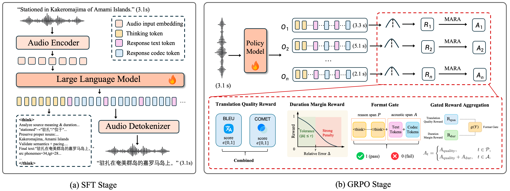

<div align="center">
  <h1>DuraS2ST</h1>
  <p><b><i>Chain-of-Thought and Reinforcement Learning for Duration-Aligned Speech-to-Speech Translation</i></b></p>
  <p>Official repository of the EMNLP 2026 Main Conference paper.</p>
  <p>
    <a href="https://github.com/Mia11939/DuraS2ST"></a>
    <a href="https://arxiv.org/abs/2609.33742"></a>
    <a href="https://huggingface.co/Mia11939/DuraS2ST-Think-RL"></a>
    <a href="https://huggingface.co/datasets/Mia11939/DuraSet-440K"></a>
    <a href="https://mia11939.github.io/DuraS2ST-Demo/"></a>
  </p>
</div>

---

## News

- **[2026-08-21]** 🎉 **DuraS2ST** is accepted to the **EMNLP 2026 Main Conference** (**15.4% acceptance rate** for Main Conference papers).

## Introduction

**DuraS2ST** is a reasoning-based framework for duration-aligned speech-to-speech translation. It explicitly plans the target wording and phonetic length before speech generation, and is optimized with duration-aware multimodal reinforcement learning.

This repository supports English↔Chinese speech translation with vLLM.

## Overview

<div align="center">
  
</div>

## Installation

Requires Linux (x86_64), FFmpeg, and an NVIDIA GPU with a CUDA 12.8-compatible driver
(tested on an A100 80 GB). Install [uv](https://docs.astral.sh/uv/getting-started/installation/), then run:

```bash
git clone https://github.com/Mia11939/DuraS2ST.git
cd DuraS2ST
uv sync --frozen
```

The locked environment includes the StepAudio2 vLLM backend and speech decoder,
sharing the same PyTorch installation. CUDA kernels are downloaded prebuilt.

## Inference

Run with [DuraS2ST-Think-RL](https://huggingface.co/Mia11939/DuraS2ST-Think-RL). The model and its speech decoder are downloaded automatically on first use:

```bash
uv run --frozen inference.py \
  --model Mia11939/DuraS2ST-Think-RL \
  --input-audio /path/to/source.wav \
  --target-language zh \
  --output-audio outputs/translation.wav
```

Use `zh` for English-to-Chinese and `en` for Chinese-to-English. The script
prints the translation and saves the generated speech. Add `--show-reasoning`
to print the duration-planning rationale.

To use a local download, replace the model ID with its directory path and keep
the `token2wav/` subdirectory intact. No separate adapter is required.
The input recording also supplies the speaker prompt.

## Acknowledgements

This project is built on [Step-Audio 2](https://github.com/stepfun-ai/Step-Audio2). We thank the authors for releasing their models and inference code.

## License

The code in this repository is released under the [Apache License 2.0](LICENSE). The [model weights](https://huggingface.co/Mia11939/DuraS2ST-Think-RL) are also released under Apache License 2.0. Third-party attribution is retained in [NOTICE](NOTICE).
